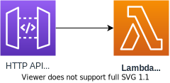
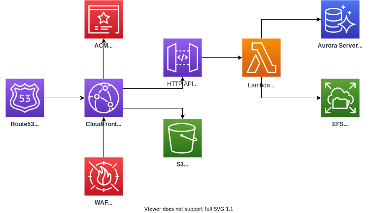

# cdk-serverless-php-mpa

Inspired in-part by [cdk-serverless-lamp](https://github.com/aws-samples/cdk-serverless-lamp) (which was limited to Laravel SPAs). This `cdk-serverless-php-mpa` repo contains a JSII construct library that allows you to deploy an AWS Serverless "LAMP" stack with AWS CDK that attempts support traditional multi-page applications.

## Requirements

- Docker


## Example deployments

See [CDK Workshop](https://cdkworkshop.com/) for the background required to understand how to use the below examples.

### Basic PHP app deployment



Create a basic PHP deployment using Lambda & HTTP API. Similar to a traditional Linux + PHP + Apache setup.

```
const code = new Code(stack, 'PhpMpaCode', {
  src: 'src/basic-php-app/',
});
```

### Complex PHP app deployment



Create a complex PHP deployment using Lambda, HTTP API, RDS, EFS, CloudFront, WAF, ACM, and Route53.  Similar to a traditional LAMP stack with the added bonus of auto-configurable SSL/TLS, custom domains, and a rudimentary firewall.

```
const network = new Network(stack, 'PhpMpaNetwork');

const database = new Database(stack, 'PhpMpaDatabase', {
  network: network,
  name: 'PhpMpaDatabaseIntegTest',
});

const filesystem = new Filesystem(stack, 'PhpMpaFilesystem', {
  network: network,
});

const code = new Code(stack, 'PhpMpaCode', {
  src: 'src/basic-php-app/',
  database: database,
  network: network,
  filesystem,
});

const domain = new Domain(stack, 'PhpMpaDomain', {
  name: 'example.com',
  hostedZone: route53.HostedZone.fromHostedZoneAttributes(stack, 'PhpMpaHostedZone', {
    hostedZoneId: 'Z2N1QZPV2S5PMX',
    zoneName: 'example.com',
  });
});

const cdn = new Cdn(stack, 'PhpMpaCdn', {
  code,
  domain,
  waf: {
    allowListIpsV4: [
      '192.0.2.0/32',
    ],
    allowListIpsV6: [
      '2001:db8::/128',
    ],
    rateLimit: 100,
  },
});
```

## Library and Construct resource options

See [API.md](API.md) for full options.